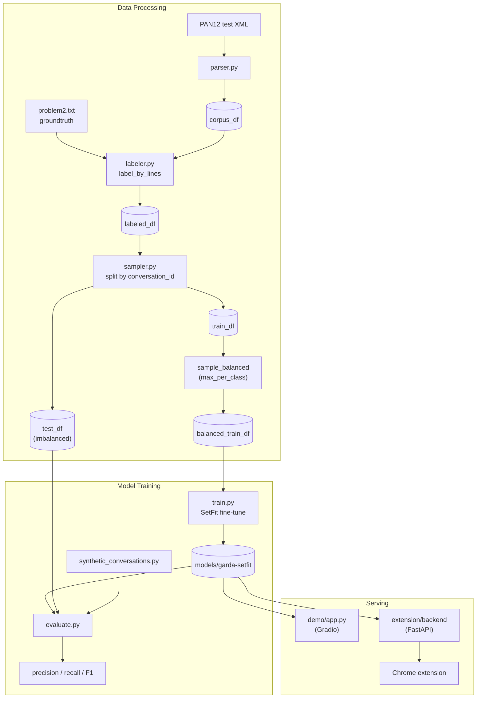

# GARDA (Grooming Alert and Detection Analysis)

GARDA is a text classifier that flags indications of _online predatory
grooming_ in English-language chat conversations. It's built around a
few-shot [SetFit](https://github.com/huggingface/setfit) model
(`all-MiniLM-L6-v2`) fine-tuned on the [PAN12 Sexual Predator
Identification](https://pan.webis.de/clef12/pan12-web/sexual-predator-identification.html)
corpus, wrapped into a Gradio demo and a browser-extension product
simulation.

## How it works

Each message in a conversation is scored individually (binary classifier:
suspicious vs. normal), using a short window of the preceding messages as
context so the model isn't judging a line in total isolation
(`data_processing/context.py`).

## Project structure

```
data/
  raw/            # PAN12 corpus - NOT included, see "Data" below
  processed/
    parsed/       # parser.py output: XML -> per-message dataframes (cached as pickle)
    sampled/      # sampler.py output: labeled, split, class-balanced train/test sets

data_processing/
  parser.py       # PAN12 XML -> pandas dataframe (with pickle caching)
  labeler.py      # attaches an is_suspicious label, two ways (see "Labeling" below)
  sampler.py      # conversation-level train/test split + class balancing
  context.py      # builds the "previous N messages" context window per line

model_training/
  train.py               # fine-tunes SetFit on the balanced train split
  evaluate.py             # precision/recall/F1 + confusion matrix, incl. threshold tuning
  error_analysis.py       # (WIP) qualitative look at false positives/negatives
  synthetic_conversations.py  # hand-written conversations, safe to commit/share

configs/
  paths.py        # all data/model paths, relative - see "Path conventions" below

models/
  garda-setfit/    # trained model artifact (gitignored, generated locally)

demo/
  app.py          # Gradio demo - paste a conversation, get a per-line risk score

extension/
  backend/main.py      # FastAPI backend serving the model to the extension
  content/, popup/      # Chrome extension (Manifest V3): badges risky lines in-page
  mock_page/            # a fake chat UI to demo the extension against (no real platform access)

notebooks/
  garda_final.ipynb     # submission notebook, calls into the modules above

upload_model_to_hf.py   # one-off script to push the trained model to a HF Hub repo
```

## Getting started

```bash
python -m venv .venv
.venv\Scripts\activate        # Windows
pip install -r requirements.txt
```

**Note:** `requirements.txt` pins `transformers<5.0` — the installed
`setfit` version doesn't yet support `transformers` 5.x (breaks on import).

### Data

The PAN12 corpus contains real predator conversations from actual sting
operations, used here under restricted, non-redistribution permission.
It is **not included in this repo**, `data/raw/` and everything under
`data/processed/` are gitignored. To reproduce the pipeline, place the
PAN12 training and test corpora under:

```
data/raw/pan12-training/
data/raw/pan12-test/
```

`synthetic_conversations.py` contains hand-written, non-sensitive example
conversations used for qualitative evaluation and the demo, so most of the
project can be explored without access to the real dataset.

### Path conventions

All data/model paths live in `configs/paths.py` as **relative** paths.
Each module resolves its own `PROJECT_ROOT` (via its own `__file__`) and
joins it with the relative paths from `configs`. Because of this, run
modules with `-m` from the project root, not as bare scripts:

```bash
python -m data_processing.parser
python -m data_processing.labeler
python -m data_processing.sampler
python -m model_training.train
python -m model_training.evaluate
```

## Pipeline



1. **Parse** (`data_processing/parser.py`) — turns the PAN12 XML into a
   dataframe (`conversation_id`, `author_id`, `time`, `text`, `line`),
   cached to `data/processed/parsed/` as pickle.
2. **Label** (`data_processing/labeler.py`) — two labeling strategies:
   - _by author_: message is `suspicious` if its author is on PAN12's
     predator-ID list (available for both the training and test corpora,
     but noisy — it labels every message from a predator, not just the
     grooming ones).
   - _by line_: message is `suspicious` only if it's explicitly listed in
     PAN12's line-level groundtruth (`problem2.txt`) — precise, but only
     available for the PAN12 **test** corpus.
3. **Split & sample** (`data_processing/sampler.py`) — since only the
   PAN12 test corpus has precise line-level labels, it's treated as the
   _only_ corpus and split ourselves into train/test **by
   `conversation_id`** (not by row, to avoid leaking a conversation's
   style/context across the split). The train side is then downsampled to
   a small, class-balanced set (few-shot scale, not the full imbalanced
   corpus) via `sample_balanced(max_per_class=...)`.
4. **Train** (`model_training/train.py`) — fine-tunes SetFit on the
   balanced train split, saves to `models/garda-setfit/`.
5. **Evaluate** (`model_training/evaluate.py`) — scores the held-out
   (naturally imbalanced) test split and the hand-written synthetic
   conversations; reports precision/recall/F1/confusion matrix, with recall
   on the suspicious class weighted as the priority (a missed grooming
   message is worse than a false alarm).

## Demo

```bash
python -m demo.app
```

Paste a conversation as `Speaker: message` lines and get a per-line risk
score and band (Low/Medium/High).

## Browser extension (product simulation)

1. Start the backend: `python -m extension.backend.main` (serves the model
   API and the mock chat page at `/mock-chat`).
2. Load `extension/` as an unpacked extension in Chrome.
3. Open `http://localhost:8000/mock-chat` — the extension badges risky
   lines directly in the mock chat UI.
